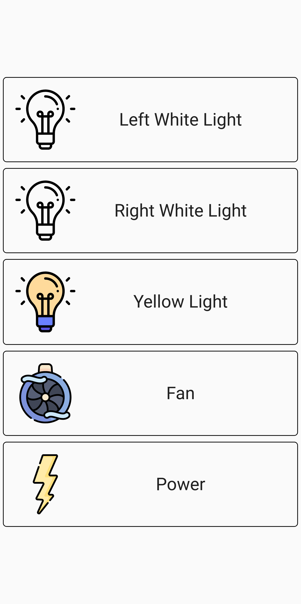
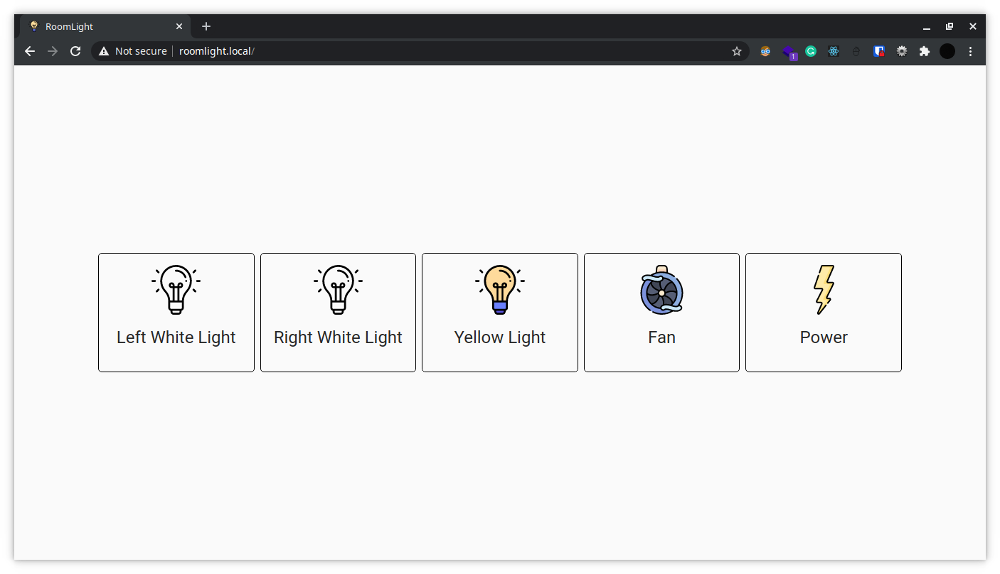

# RoomLight-Web
A web version of my old project which I made to control relays in my room. Instead of HC-05, it now uses NodeMcu to control them. NodeMcu runs a web server that exposes an API to control the relays and also serves a React app on my LAN accessible at http://roomlight.local which utilizes the API.
## Video (Click on it to go to Youtube)

## Screenshots

## How to make something similar
(I will not talk about how to make the react app or how to connect nodemcu with the relay. Just point you in the right direction and highlight the pitfalls) 
### Only the API
Look at this [file](./arduino/roomlight_api_only/roomlight.ino). 
It is simple and will work for most of your use cases.  
Just change the SSID, password and adapt the JSON response according to your needs. You can use the Arduino IDE and it should work without any issues.
### Both the API and React app
Look at this [file](./arduino/RoomLight/src/main.cpp) for the NodeMcu code. Change the SSID, password and adapt the json response according to your needs.
- You will need to use [PlatformIO](https://platformio.org/) instead of the Arduino IDE for this.
- The API part is very similar to the earlier example but a few changes have been made to make it work with [ESPAsyncWebServer](https://github.com/me-no-dev/ESPAsyncWebServer)
-  For the React App 
	-  Try to make the app as small as possible. I was not able to upload anything larger than 1mb (which I am guessing is the flash size). Not generating source maps helps, see my build script in package.json
	-  Upload the contents of your **build** folder to the NodeMcu by following the instructions [here](https://docs.platformio.org/en/latest/platforms/espressif8266.html#uploading-files-to-filesystem). You need to use LittleFS instead of SPIFFS because the latter does support directories.
## Attribution
Icons made by [Freepik](https://www.freepik.com) from [Flaticon](https://www.flaticon.com/)
